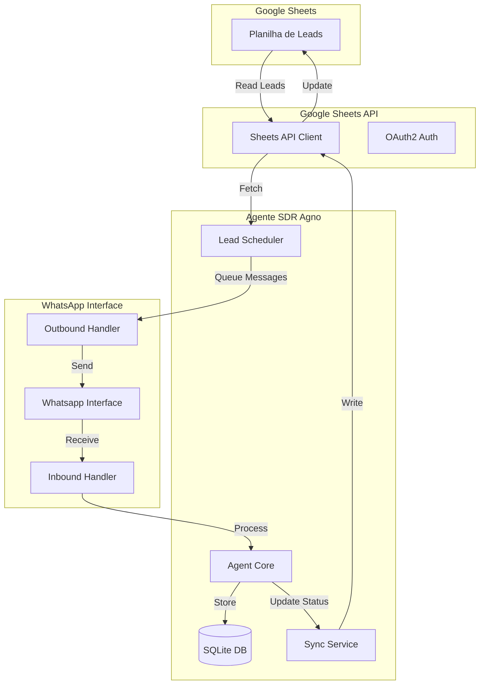

# Design Técnico: Integração Google Sheets com Agente SDR Agno

## Overview

Esta integração conecta o agente SDR Agno com Google Sheets para automatizar o gerenciamento de leads e conversas via WhatsApp. O sistema permite que o agente leia leads de uma planilha, inicie conversas proativas (outbound), processe respostas recebidas (inbound), e sincronize o status das interações de volta para a planilha.

### Objetivos

- Automatizar o processo de prospecção via WhatsApp usando dados estruturados do Google Sheets
- Gerenciar conversas bidirecionais (envio e recebimento de mensagens)
- Manter sincronização em tempo real do status dos leads
- Preservar o histórico completo de interações
- Evitar duplicação de contatos e mensagens

### Escopo

**Incluído:**
- Leitura periódica de leads do Google Sheets
- Envio automatizado de mensagens iniciais via WhatsApp (outbound)
- Processamento de respostas recebidas via WhatsApp (inbound)
- Atualização de status na planilha (pendente, contatado, respondeu, qualificado, etc.)
- Registro de timestamps de interações
- Gerenciamento de sessões de conversa

**Não incluído:**
- Interface web para gerenciamento manual
- Integração com CRM externo
- Análise de sentimento avançada
- Automação de follow-ups complexos (será tratado em feature futura)

## Architecture

### Visão Geral da Arquitetura



### Componentes Principais

1. **Google Sheets Connector**: Gerencia autenticação e operações de leitura/escrita
2. **Lead Scheduler**: Processa novos leads e agenda envios
3. **WhatsApp Outbound Handler**: Gerencia envio de mensagens proativas
4. **WhatsApp Inbound Handler**: Processa respostas recebidas
5. **Sync Service**: Sincroniza status entre DB local e Google Sheets
6. **Session Manager**: Gerencia contexto de conversas

### Fluxo de Dados

**Fluxo Outbound (Prospecção):**
1. Scheduler lê novos leads do Google Sheets (status = "pendente")
2. Para cada lead, cria uma sessão no banco de dados
3. Envia mensagem inicial via WhatsApp
4. Atualiza status para "contatado" no Google Sheets
5. Registra timestamp do envio

**Fluxo Inbound (Resposta):**
1. WhatsApp Interface recebe mensagem
2. Identifica sessão existente pelo número do telefone
3. Agent processa mensagem com contexto da sessão
4. Gera resposta apropriada
5. Atualiza status para "respondeu" ou "qualificado" conforme análise
6. Sincroniza atualização com Google Sheets

## Components and Interfaces

### 1. Google Sheets Connector

```python
class GoogleSheetsConnector:
    """Gerencia integração com Google Sheets API"""
    
    def __init__(self, credentials_path: str, spreadsheet_id: str):
        """Inicializa com credenciais OAuth2 e ID da planilha"""
        
    def read_leads(self, status_filter: str = "pendente") -> List[Lead]:
        """Lê leads da planilha com filtro de status"""
        
    def update_lead_status(self, phone: str, status: str, 
                          last_contact: datetime, notes: str = "") -> bool:
        """Atualiza status de um lead específico"""
        
    def batch_update_leads(self, updates: List[LeadUpdate]) -> bool:
        """Atualiza múltiplos leads em uma operação"""
```

### 2. Lead Scheduler

```python
class LeadScheduler:
    """Gerencia agendamento e processamento de leads"""
    
    def __init__(self, sheets_connector: GoogleSheetsConnector, 
                 db: SqliteDb, interval_seconds: int = 300):
        """Inicializa scheduler com intervalo de polling"""
        
    async def poll_new_leads(self) -> None:
        """Verifica periodicamente por novos leads"""
        
    async def process_lead(self, lead: Lead) -> bool:
        """Processa um lead individual"""
        
    def should_contact_lead(self, lead: Lead) -> bool:
        """Determina se um lead deve ser contatado agora"""
```

### 3. WhatsApp Outbound Handler

```python
class WhatsAppOutboundHandler:
    """Gerencia envio de mensagens proativas"""
    
    def __init__(self, whatsapp_interface: Whatsapp, agent: Agent):
        """Inicializa com interface WhatsApp e agente"""
        
    async def send_initial_message(self, lead: Lead) -> bool:
        """Envia mensagem inicial personalizada para um lead"""
        
    async def create_session(self, lead: Lead) -> str:
        """Cria sessão de conversa para o lead"""
        
    def format_initial_message(self, lead: Lead) -> str:
        """Formata mensagem inicial usando dados do lead"""
```

### 4. WhatsApp Inbound Handler

```python
class WhatsAppInboundHandler:
    """Processa mensagens recebidas"""
    
    def __init__(self, agent: Agent, sync_service: SyncService):
        """Inicializa com agente e serviço de sincronização"""
        
    async def handle_incoming_message(self, phone: str, 
                                     message: str, 
                                     session_id: str) -> str:
        """Processa mensagem recebida e retorna resposta"""
        
    async def classify_response(self, message: str, 
                               session_history: List[Message]) -> str:
        """Classifica resposta para determinar novo status"""
        
    def extract_qualification_signals(self, message: str) -> Dict[str, Any]:
        """Extrai sinais de qualificação da mensagem"""
```

### 5. Sync Service

```python
class SyncService:
    """Sincroniza dados entre DB local e Google Sheets"""
    
    def __init__(self, sheets_connector: GoogleSheetsConnector, 
                 db: SqliteDb):
        """Inicializa com conector e banco de dados"""
        
    async def sync_lead_status(self, phone: str, new_status: str, 
                              notes: str = "") -> bool:
        """Sincroniza status de um lead"""
        
    async def sync_batch(self, batch_size: int = 50) -> int:
        """Sincroniza lote de atualizações pendentes"""
        
    def queue_update(self, update: LeadUpdate) -> None:
        """Adiciona atualização à fila de sincronização"""
```

### 6. Session Manager

```python
class SessionManager:
    """Gerencia sessões de conversa"""
    
    def __init__(self, db: SqliteDb):
        """Inicializa com banco de dados"""
        
    def get_or_create_session(self, phone: str, lead_data: Dict) -> str:
        """Obtém sessão existente ou cria nova"""
        
    def update_session_context(self, session_id: str, 
                               context: Dict[str, Any]) -> None:
        """Atualiza contexto da sessão"""
        
    def get_session_history(self, session_id: str, 
                           limit: int = 10) -> List[Message]:
        """Recupera histórico da sessão"""
```

## Data Models

### Lead Model

```python
@dataclass
class Lead:
    """Representa um lead da planilha"""
    phone: str  # Formato: +5511999999999
    name: str
    company: str
    email: str
    status: str  # pendente, contatado, respondeu, qualificado, desqualificado
    source: str  # origem do lead
    notes: str
    created_at: datetime
    last_contact: Optional[datetime]
    sheet_row: int  # linha na planilha para updates
```

### LeadUpdate Model

```python
@dataclass
class LeadUpdate:
    """Representa uma atualização de lead"""
    phone: str
    status: str
    last_contact: datetime
    notes: str
    sheet_row: int
    synced: bool = False
    created_at: datetime = field(default_factory=datetime.now)
```

### Message Model

```python
@dataclass
class Message:
    """Representa uma mensagem na conversa"""
    session_id: str
    phone: str
    content: str
    direction: str  # inbound, outbound
    timestamp: datetime
    status: str  # sent, delivered, read, failed
    metadata: Dict[str, Any]
```

### Session Model

```python
@dataclass
class Session:
    """Representa uma sessão de conversa"""
    session_id: str
    phone: str
    lead_data: Dict[str, Any]
    status: str
    created_at: datetime
    updated_at: datetime
    message_count: int
    last_message_at: Optional[datetime]
    context: Dict[str, Any]  # contexto adicional da conversa
```

### Google Sheets Structure

A planilha deve ter as seguintes colunas (ordem flexível):

| Coluna | Tipo | Descrição | Obrigatório |
|--------|------|-----------|-------------|
| phone | string | Telefone com código do país | Sim |
| name | string | Nome do lead | Sim |
| company | string | Empresa | Não |
| email | string | Email | Não |
| status | string | Status atual | Sim |
| source | string | Origem do lead | Não |
| notes | string | Observações | Não |
| created_at | datetime | Data de criação | Sim |
| last_contact | datetime | Último contato | Não |

**Status válidos:**
- `pendente`: Lead novo, não contatado
- `contatado`: Mensagem inicial enviada
- `respondeu`: Lead respondeu
- `qualificado`: Lead demonstrou interesse
- `desqualificado`: Lead não tem fit
- `erro`: Erro no envio

### Database Schema

```sql
-- Tabela de leads (cache local)
CREATE TABLE leads (
    phone TEXT PRIMARY KEY,
    name TEXT NOT NULL,
    company TEXT,
    email TEXT,
    status TEXT NOT NULL,
    source TEXT,
    notes TEXT,
    created_at TIMESTAMP NOT NULL,
    last_contact TIMESTAMP,
    sheet_row INTEGER NOT NULL,
    synced_at TIMESTAMP
);

-- Tabela de atualizações pendentes
CREATE TABLE lead_updates (
    id INTEGER PRIMARY KEY AUTOINCREMENT,
    phone TEXT NOT NULL,
    status TEXT NOT NULL,
    last_contact TIMESTAMP NOT NULL,
    notes TEXT,
    sheet_row INTEGER NOT NULL,
    synced BOOLEAN DEFAULT FALSE,
    created_at TIMESTAMP DEFAULT CURRENT_TIMESTAMP,
    synced_at TIMESTAMP
);

-- Índices para performance
CREATE INDEX idx_leads_status ON leads(status);
CREATE INDEX idx_updates_synced ON lead_updates(synced);
CREATE INDEX idx_leads_last_contact ON leads(last_contact);
```


## Correctness Properties

*A property is a characteristic or behavior that should hold true across all valid executions of a system-essentially, a formal statement about what the system should do. Properties serve as the bridge between human-readable specifications and machine-verifiable correctness guarantees.*

### Property Reflection

Após análise do prework, identifiquei as seguintes redundâncias:
- Propriedades 4.4 e 7.3 são idênticas (erro de sincronização mantém na fila)
- Propriedades sobre persistência de mensagens (2.5, 6.1) podem ser combinadas
- Propriedades sobre filtro de status (5.3, 5.4) podem ser generalizadas

### Property 1: Lead Reading Completeness

*For any* execution of the scheduler, all leads with status "pendente" in the Google Sheets SHALL be read and processed.

**Validates: Requirements 1.2**

### Property 2: Phone Validation Enforcement

*For any* lead read from the spreadsheet, if the phone field is missing or not in international format, the lead SHALL be rejected with validation error.

**Validates: Requirements 1.3**

### Property 3: Lead Persistence Round-Trip

*For any* valid lead read from Google Sheets, after storage in the local database, retrieving it SHALL return equivalent data.

**Validates: Requirements 1.4**

### Property 4: Error Recovery Resilience

*For any* read operation that fails, the system SHALL log the error and the lead SHALL remain available for the next scheduler cycle.

**Validates: Requirements 1.5**

### Property 5: Outbound Message Triggers Status Transition

*For any* lead with status "pendente", after successfully sending a WhatsApp message, the lead status SHALL be "contatado".

**Validates: Requirements 2.1, 2.2**

### Property 6: Message Sending Records Timestamp

*For any* message sent via WhatsApp, the lead's last_contact field SHALL be updated with the send timestamp.

**Validates: Requirements 2.3**

### Property 7: Send Failure Marks Error Status

*For any* WhatsApp message that fails to send, the lead status SHALL be updated to "erro" and error details SHALL be recorded in notes.

**Validates: Requirements 2.4**

### Property 8: Message Sending Creates Session

*For any* outbound message sent to a lead, a corresponding session SHALL exist in the database with matching phone number.

**Validates: Requirements 2.5, 6.1**

### Property 9: Inbound Message Session Lookup

*For any* message received via WhatsApp, the system SHALL identify and retrieve the existing session using the sender's phone number.

**Validates: Requirements 3.1**

### Property 10: Inbound Processing Includes Context

*For any* inbound message processed by the agent, the processing SHALL include access to the session's message history (up to 10 previous messages).

**Validates: Requirements 3.2, 6.3**

### Property 11: Response Updates Status

*For any* inbound message successfully processed, the lead status SHALL transition from "contatado" to "respondeu".

**Validates: Requirements 3.3**

### Property 12: Message Persistence Bidirectional

*For any* message sent or received, the message SHALL be stored in the messages table with correct direction flag (inbound/outbound).

**Validates: Requirements 6.1**

### Property 13: Session History Retrieval Completeness

*For any* session accessed, retrieving its history SHALL return all messages associated with that session_id, ordered by timestamp ascending.

**Validates: Requirements 6.2, 6.5**

### Property 14: Session Metadata Updates

*For any* session that receives a new message, the updated_at timestamp and message_count SHALL be incremented.

**Validates: Requirements 6.4**

### Property 15: Status Change Queues Sync Update

*For any* lead whose status changes, a corresponding LeadUpdate SHALL be added to the sync queue with synced=false.

**Validates: Requirements 4.1**

### Property 16: Batch Sync Processes Queue

*For any* batch sync operation, all LeadUpdate records with synced=false SHALL be processed and written to Google Sheets.

**Validates: Requirements 4.2**

### Property 17: Successful Sync Marks Record

*For any* LeadUpdate successfully synchronized to Google Sheets, the synced field SHALL be true and synced_at SHALL contain the sync timestamp.

**Validates: Requirements 4.3, 4.5**

### Property 18: Failed Sync Retains Queue Entry

*For any* sync operation that fails, the LeadUpdate SHALL remain in the queue with synced=false for retry.

**Validates: Requirements 4.4, 7.3**

### Property 19: Session Reuse Prevents Duplication

*For any* lead being processed, if an active session already exists for that phone number, the existing session SHALL be reused rather than creating a new one.

**Validates: Requirements 5.1, 5.2**

### Property 20: Processed Status Filtering

*For any* scheduler execution, leads with status in ["contatado", "respondeu", "qualificado", "desqualificado"] SHALL be excluded from processing.

**Validates: Requirements 5.3, 5.4**

### Property 21: Phone Deduplication

*For any* set of leads with duplicate phone numbers, only the first occurrence SHALL be processed and subsequent duplicates SHALL be ignored.

**Validates: Requirements 5.5**

### Property 22: Error Isolation

*For any* lead that encounters a critical error during processing, the error SHALL not prevent other leads in the batch from being processed.

**Validates: Requirements 7.5**

### Property 23: Invalid Data Rejection

*For any* lead with validation errors, the lead SHALL be skipped and a detailed error log SHALL be created.

**Validates: Requirements 7.4**

### Property 24: Message Personalization with Name

*For any* initial message created for a lead, the message content SHALL include the lead's name.

**Validates: Requirements 8.1**

### Property 25: Conditional Company Mention

*For any* lead that has a non-empty company field, the initial message SHALL mention the company name.

**Validates: Requirements 8.2**

### Property 26: Source-Based Context Adaptation

*For any* lead with a specified source, the message context SHALL be adapted to reference that source.

**Validates: Requirements 8.3**

### Property 27: Fallback Message for Missing Data

*For any* lead missing required personalization data (name), a generic fallback message SHALL be used instead.

**Validates: Requirements 8.5**

## Error Handling

### Error Categories

1. **Authentication Errors**
   - Google Sheets OAuth2 token expiration
   - WhatsApp API authentication failures
   - Strategy: Automatic token refresh with exponential backoff

2. **Network Errors**
   - API timeouts
   - Connection failures
   - Strategy: Retry with exponential backoff (max 3 attempts)

3. **Validation Errors**
   - Invalid phone format
   - Missing required fields
   - Strategy: Skip lead, log detailed error, continue processing

4. **Rate Limiting**
   - Google Sheets API quota exceeded
   - WhatsApp rate limits
   - Strategy: Implement rate limiter, queue requests, backoff

5. **Data Consistency Errors**
   - Duplicate phone numbers
   - Conflicting status updates
   - Strategy: Use phone as primary key, last-write-wins for conflicts

### Error Recovery Mechanisms

```python
class ErrorHandler:
    """Centraliza tratamento de erros"""
    
    @retry(max_attempts=3, backoff=exponential_backoff)
    async def with_retry(self, operation: Callable) -> Any:
        """Executa operação com retry automático"""
        
    def should_skip_lead(self, error: Exception) -> bool:
        """Determina se lead deve ser pulado ou retentado"""
        
    async def log_error(self, context: Dict, error: Exception) -> None:
        """Registra erro com contexto completo"""
```

### Monitoring and Alerting

- Log all errors with structured logging (JSON format)
- Track error rates per category
- Alert on:
  - Authentication failures (immediate)
  - Error rate > 5% (within 5 minutes)
  - Sync queue size > 500 (within 15 minutes)
  - Failed messages > 10% (within 10 minutes)

## Testing Strategy

### Dual Testing Approach

This feature requires both unit tests and property-based tests for comprehensive coverage:

- **Unit tests**: Verify specific examples, edge cases, and error conditions
- **Property tests**: Verify universal properties across all inputs

### Property-Based Testing

We will use **Hypothesis** (Python) for property-based testing with the following configuration:

- Minimum 100 iterations per property test
- Each test tagged with: `# Feature: google-sheets-lead-integration, Property {N}: {description}`
- Custom generators for:
  - Valid/invalid phone numbers
  - Lead objects with various field combinations
  - Message sequences
  - Session states

### Test Coverage by Component

**Google Sheets Connector:**
- Unit: OAuth flow, specific API calls, error responses
- Property: Round-trip read/write, batch operations, data consistency

**Lead Scheduler:**
- Unit: Initialization, specific scheduling scenarios
- Property: All pending leads processed, status filtering, deduplication

**WhatsApp Handlers:**
- Unit: Message formatting examples, specific error cases
- Property: Message persistence, session creation, status transitions

**Sync Service:**
- Unit: Specific sync scenarios, error handling
- Property: Queue processing, sync marking, retry behavior

**Session Manager:**
- Unit: Session creation examples, context updates
- Property: Session reuse, history retrieval, metadata updates

### Example Property Test Structure

```python
from hypothesis import given, strategies as st
import hypothesis

# Feature: google-sheets-lead-integration, Property 3: Lead Persistence Round-Trip
@given(lead=st.builds(Lead, 
                      phone=st.from_regex(r'\+\d{10,15}'),
                      name=st.text(min_size=1),
                      status=st.sampled_from(['pendente', 'contatado'])))
@hypothesis.settings(max_examples=100)
async def test_lead_persistence_roundtrip(lead: Lead):
    """For any valid lead, storage and retrieval should preserve data"""
    # Store lead
    await sheets_connector.store_lead(lead)
    
    # Retrieve lead
    retrieved = await sheets_connector.get_lead(lead.phone)
    
    # Assert equivalence
    assert retrieved.phone == lead.phone
    assert retrieved.name == lead.name
    assert retrieved.status == lead.status
```

### Integration Testing

- Test complete flow: Google Sheets → Scheduler → WhatsApp → Sync
- Use test spreadsheet and WhatsApp sandbox
- Verify end-to-end status transitions
- Test error recovery scenarios

### Performance Testing

- Load test with 1000 leads
- Verify scheduler processes 100 leads/minute
- Verify sync batch processes 50 updates/operation
- Measure inbound message response time < 2s

### Test Data Management

- Use factories for generating test leads
- Maintain separate test Google Sheets
- Use WhatsApp test numbers
- Clean up test data after each test run
